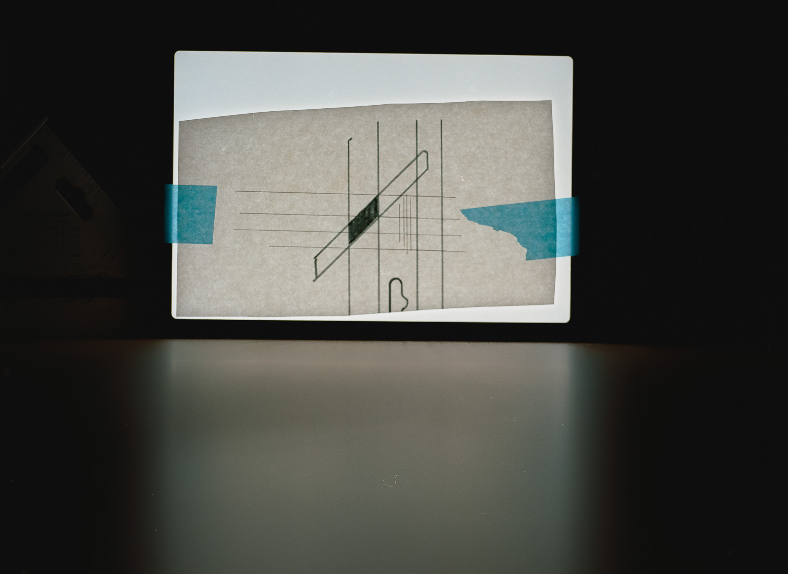
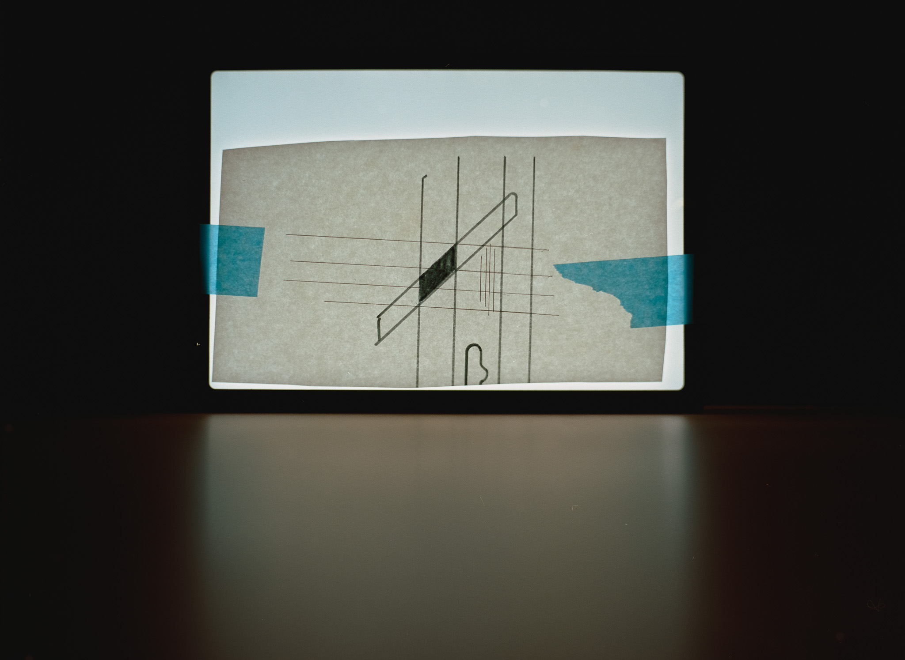
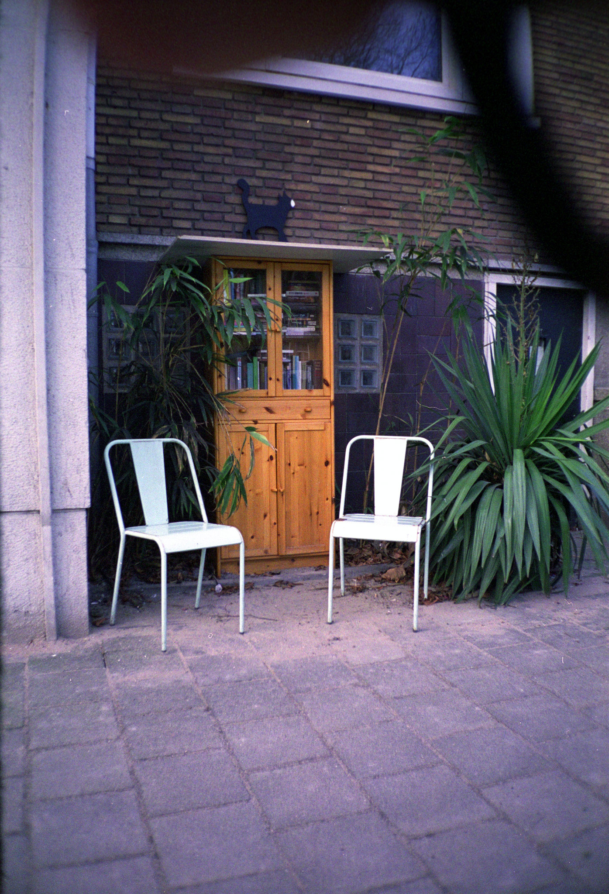
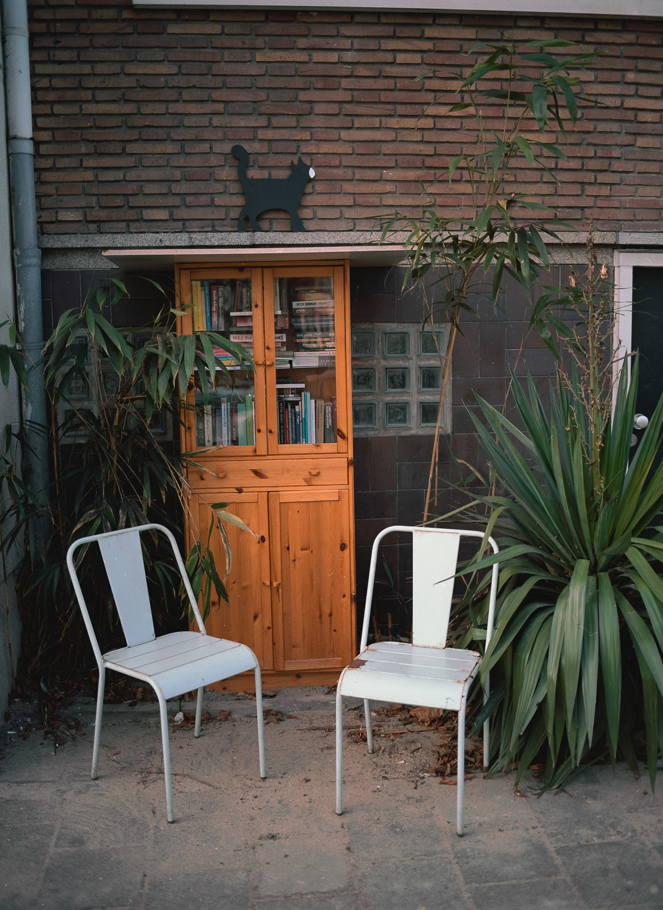
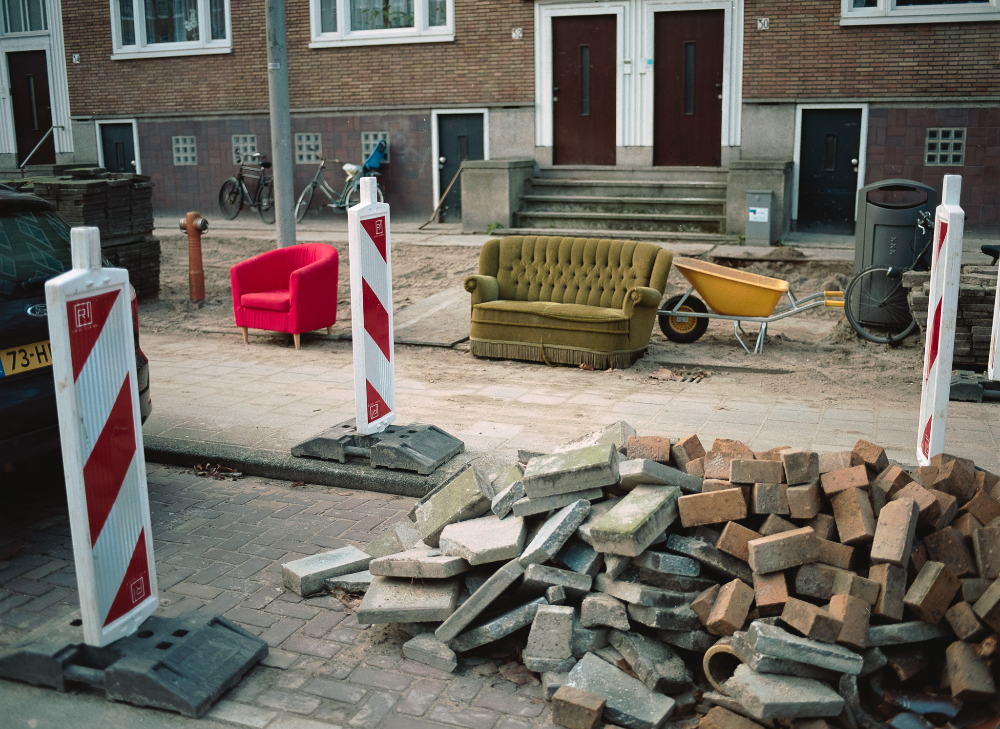
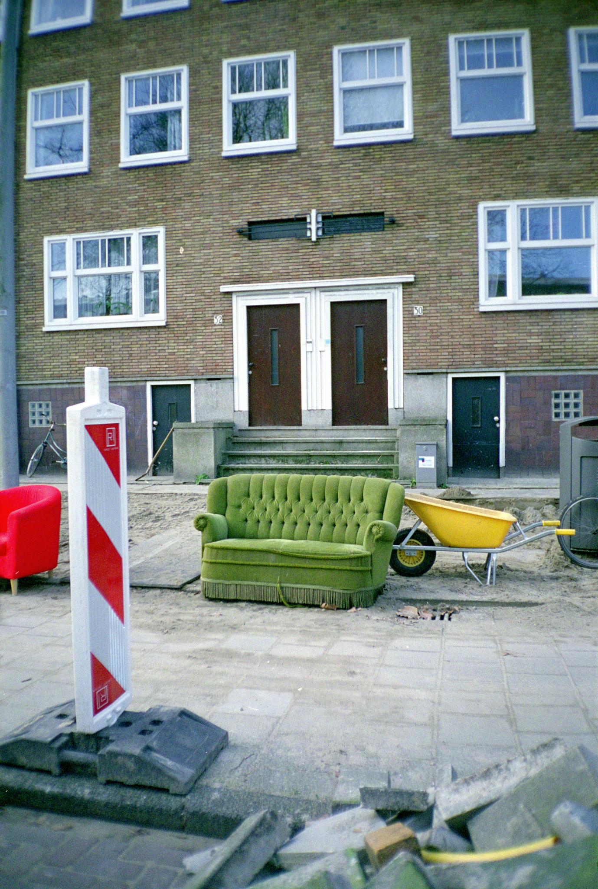

Свинья грязи найдет.

Вот и я купил себе б/у Mamiya 645 pro на ebay и получил тушку со сломанным механизмом остановки зеркала. Пришлось ремонтировать самому.

## Видео на YouTube


## Фото

Плохо:

А вот теперь хорошо:

Битва форматов:

Первые удачные кадры после ремонта:

🐍