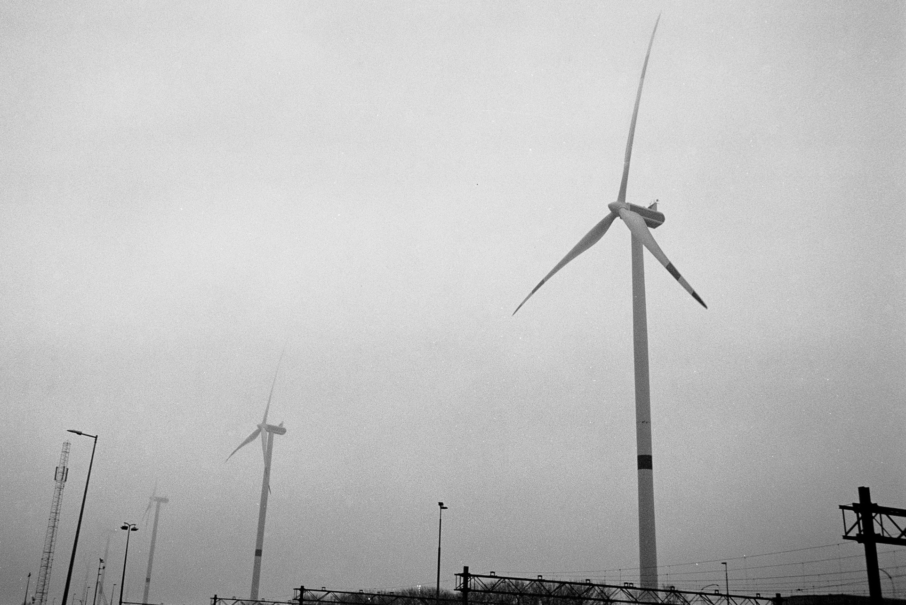

А началось то все с того, что я сдул сантиметровый слой пыли со старенького FM10 и наполнил жизнью его пустующую тушку свежим роликом черно-белой пленки. На самом деле, она как-будто бы цветная, но одноцветная. Хотя сейчас это неважно.

Забавно, но как только берешь камеру в руки, то твой мозг каким-то неожиданным образом переключается в "черно-белый" режим и начинает видеть только контрастные картинки.

 

Как говорит Кристина, я мог бы иметь успех в ее академии искусств по фото композиции. 

Но, мне повезло больше и я учился в айтишном вузе. 

 
 

Так вот, вернемся к композиции.

Этот поручень здесь специально. Я бы мог его зашопить, но пусть он здесь останется чтобы напоминать мне о том, что перфекционизм это не всегда хорошо.

Полосатое здание. Полосатая дорога. Полосатая машина. Полосатый столб. Полосатая жизнь.

Порш (кродёться)

Почему Кристина не резкая? Потому что я заранее ей отомстил за нерезкий снимок со мной, который она сделает через 5 минут.

Орел - птица гордая!

А этот день отлично демонстрирует особенности национальной погоды в Нидерландах.

Для сравнения, цветная фотография:

Ни черта вообще не было видно за 100 метров.

И еще несколько кадров для тех, кто доскроллил до этого момента.

 

Вот такое приключение вышло у старичка.

Его место сейчас занял более современный F80. Но, зато теперь он стоит на полке за стеклом и больше не пылится. Хэппи энд.