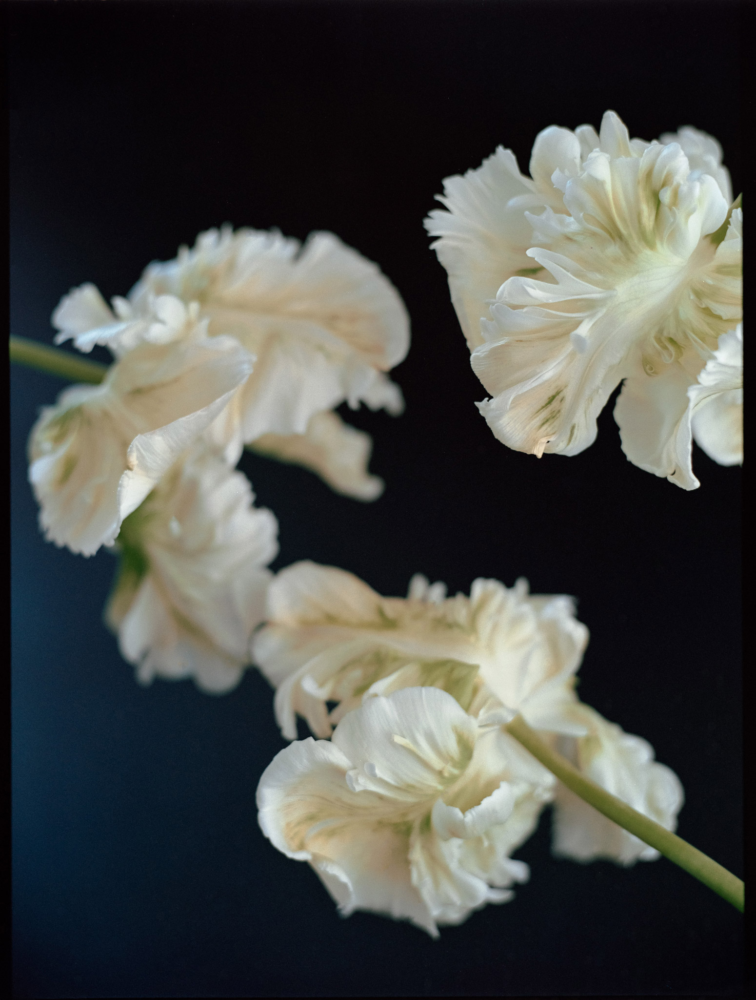

<!--  -->
<!--  -->

И на старуху бывает проруха -- движок рекомендаций ютуба наконец-то посоветовал что-то дельное. При виде букв "CS193p" у меня аж дыхание на секунду остановилось. Неужели тот самый Пол, что и 9 лет назад!

Да, все тот же Пол, все тот же Developing Apps for iOS  CS193, все тот же Стендфорд. Отличия только два:
1. мне не 22 года (Пол тоже постарел, но все еще шикарен),
2. из-за короны, лекции были записаны из дома.

После того, как ритм дыхания выровнялся, начались флешбеки. Минск, весна, последний год универа, лаба епама по iOS разработке, крутая компания (Олег и Ко привет!).

Такая маленькая кремниевая долина где мы учились писать что-то отдаленно похожее на продакшн код. Ваня Киркоров был нашим тутором и показывал нам ролики с WWDC. А потом отрыл для нас этот курс со Стендфорда.

Прошло почти 10 лет, а у меня все тот же щенячий восторг от того, на каком высоком и одновременно доступном уровне может происходить образование.

За неделю, на 1.5x, я буквально проглотил все лекции на одном дыхании. Под конец, мозг уже начал распухать от такого потока информации, но смотреть это было круче, чем нетфликс. Тут тебе и теория, и лайв кодинг, и проектирование, и паттерны, и информация о платформе. В общем, не соскучишься.

И это при том, что 90% информации для меня не были новой. Но так захватывает!

И особый кайф в том, что курс постоянно меняется и всегда остается актуальным, не смотря на то, что никто уже и не вспомнит Objective-C, а SwiftUI скоро станет стандартом по умолчанию.

А вот после просмотра осталась какая-то пустота и ощущение тлена. Мой мозг начал вспоминать мой универ и сравнивать с тем, как, и по каким унылым программам у меня было образование.

5 лет тягомотины: половина предметов была в прямом смысле прочитана и только половина от оставшейся половины была сделана крутыми преподами. Остальное было просто неактуально. Даже в говне динозавра сейчас было больше пользы, чем от того бреда, что в нас пихали.

Возможно, только из-за них (и из-за обещания маме, конечно же) я не отчислился и дотошнил универ до диплома.

Ну а дальше, уже в бою, приходилось на лету как-то связывать то ФУНДАМЕНТАЛЬНОЕ СОВЕТСКОЕ, что нам давали, с реалиями жизни и новыми технологиями.

А оказывается, что можно можно и рыбку съесть, и получить актуальное образование.

Такая вот история. К чему я это все? Да хз.

Белые -- мои, а те, которые на темном фоне, снимала [Кристина](https://www.instagram.com/kristina_kutena/).

