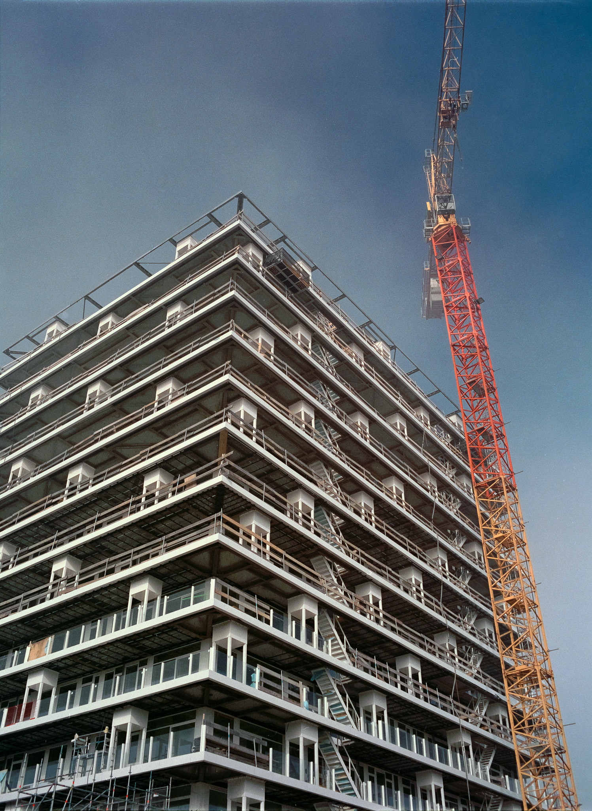
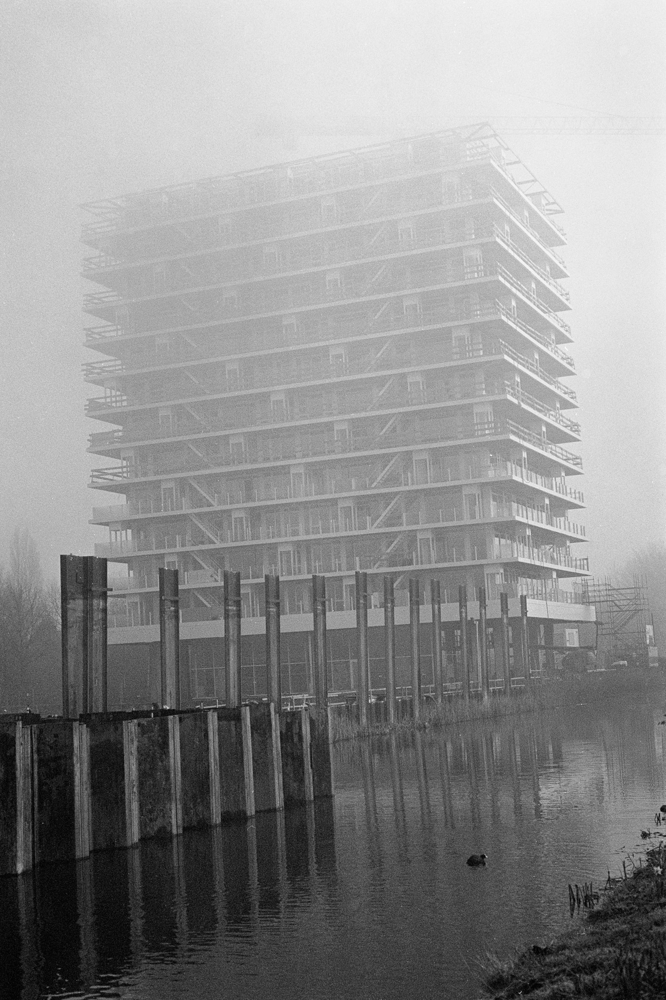
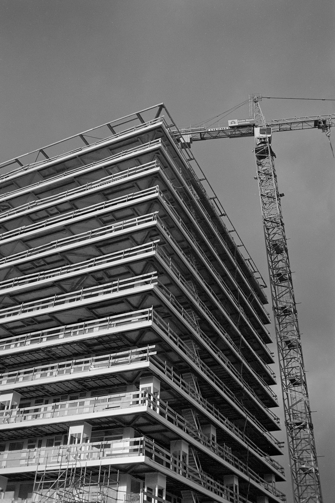
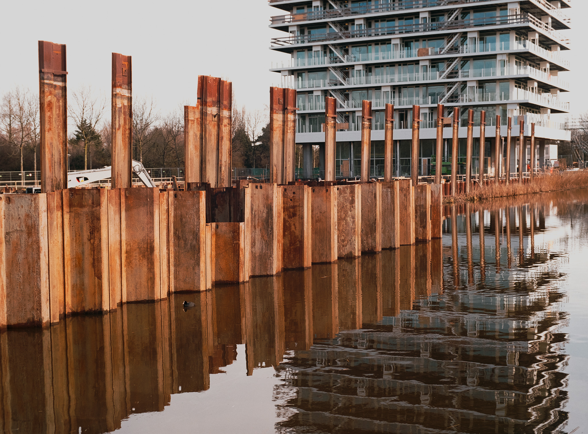
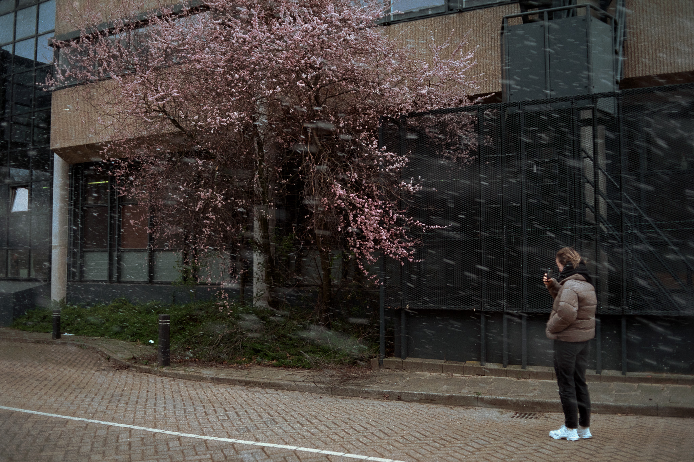
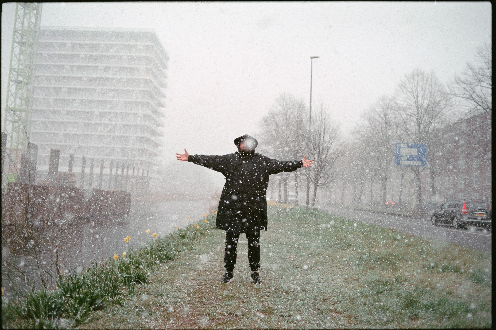
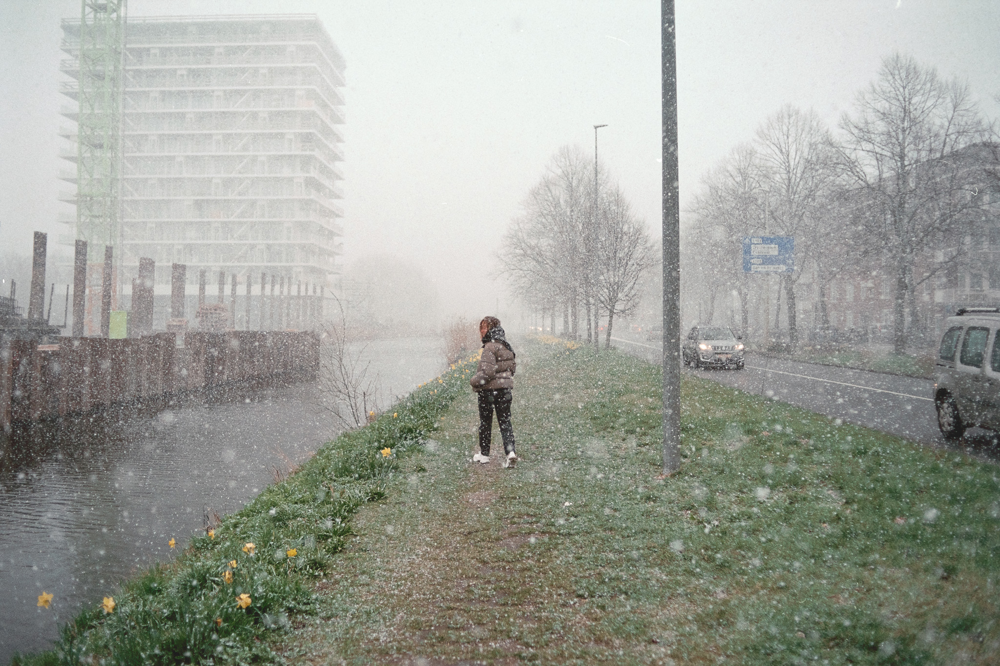
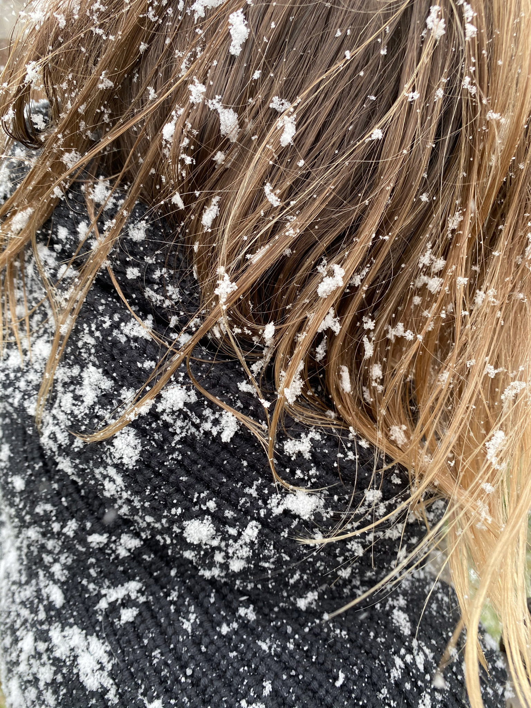
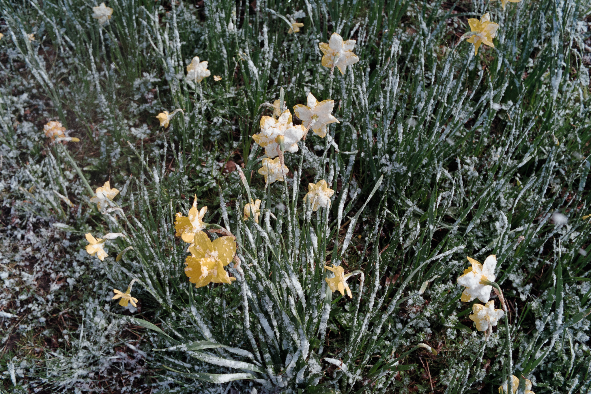
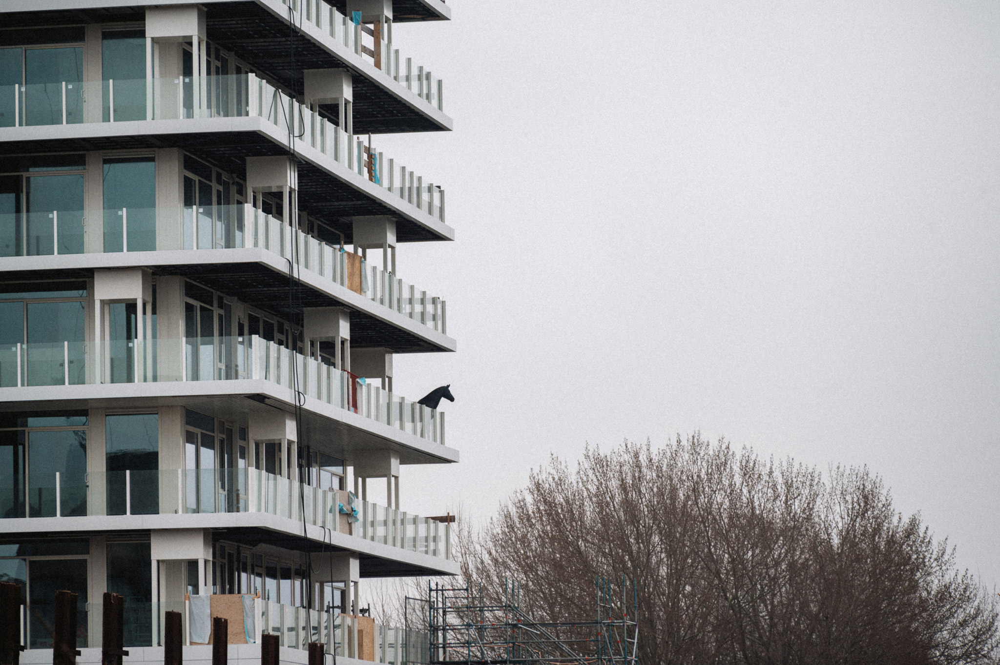

Честно, нет ничего более банального, чем снимать стройки и краны.

Но когда в городе введен комендантский час, а все кафе работают строго на вынос, то только и остается, что ходить туда-сюда по району.

А все дороги у нас с Крис ведут в местную кафешку.

Иногда бывает, идешь туда -- туман, ничерта не видно. А обратно, через 20 минут, как-будто ничего и не было.

Выселили утку.

Думаете это ветер срывает лепестки цветущего дерева?

Фигушки, это снег в апреле.

Не каждый нарцисс в своей жизни может похвастаться тем, что видел снег.

Да. Это конь. Обычный день на стройке в Амстердаме.

🐍