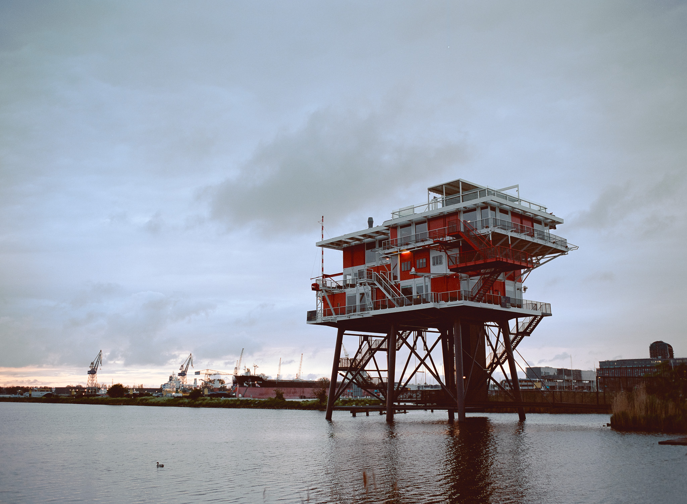
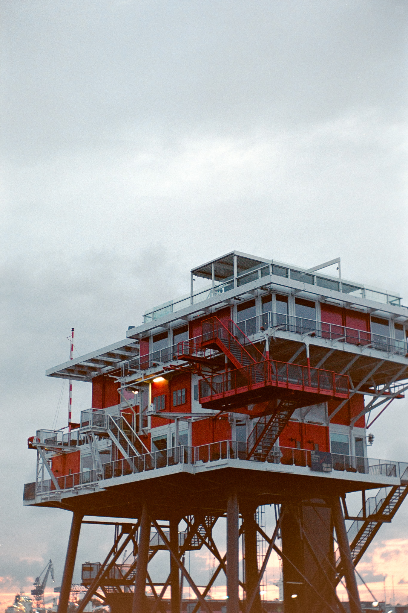
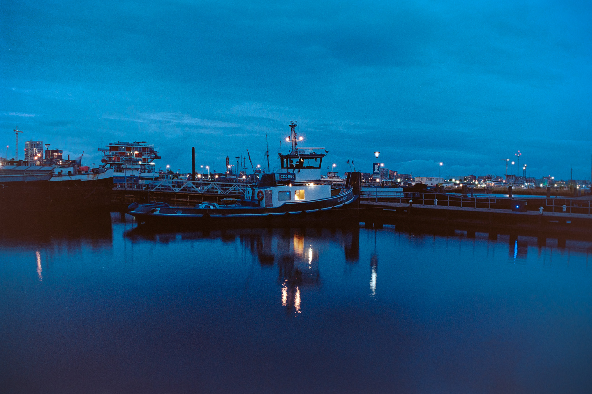
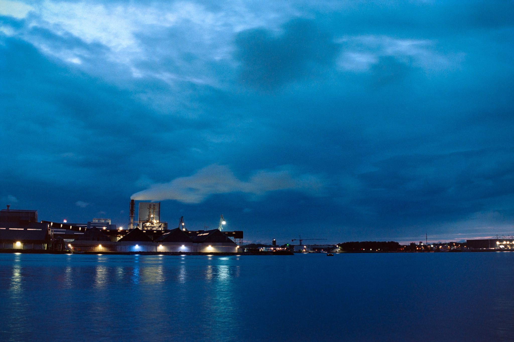
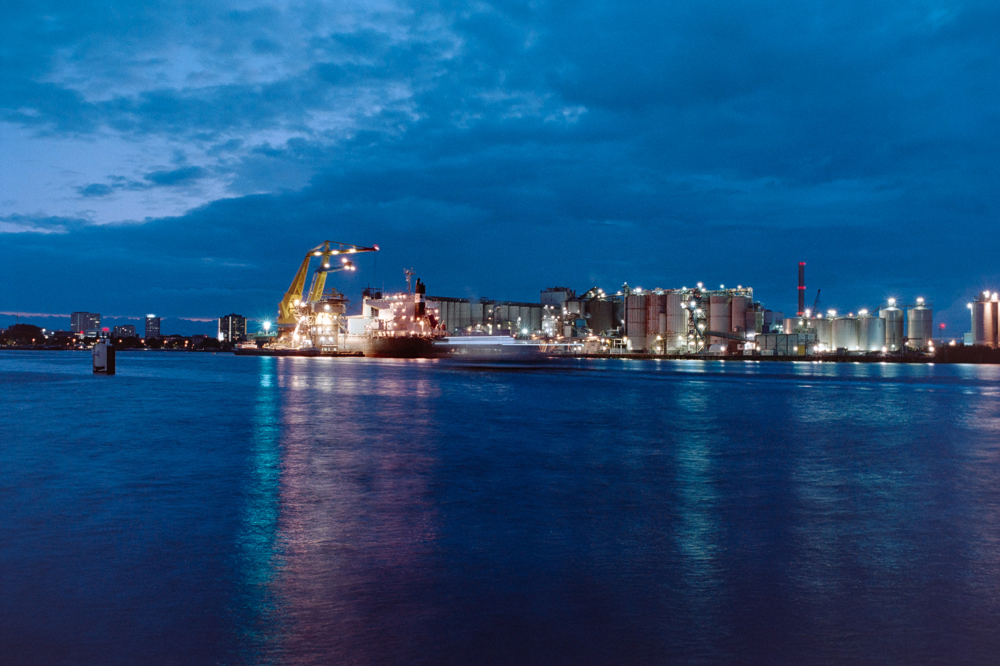
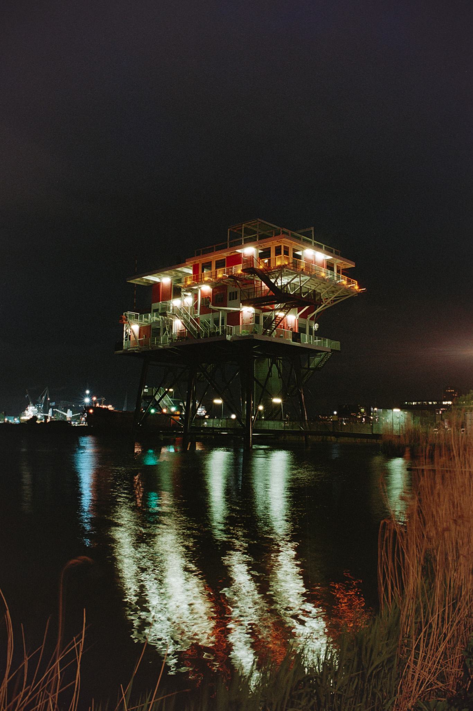

Вкратце: мне нужно было добить 3 кадра широкой пленки, чтобы проявить поездку на море с [прошлого поста](https://www.snek.sh/p/zomer-zokat/). В итоге добил и узкую:)

Собственно, про эту вылазку и будет это видео.

## Видео на YouTube


## Фото

Света нет, зато есть уточка.

Где еще 2 кадра? 👐🏻💩

Все, что ниже, это уже UltraMax 400 на F80.

🐍 