Так вышло, что после переезда в НЛ я перестал снимать. Т.е. вообще, совсем, никак. И никого. Хотя до этого я снимал 9 лет и за спиной было около 200 свадебных съемок😬 (почему так вышло — ниже).

А тут, впервые за 6 лет, я снимал "живых людей".

Мне кажется, получилось оч хорошо и смело можно составить [Кристине](https://www.instagram.com/kristina_kutena/) конкуренцию, хах.

## Фото

Так вот, Васю с Аней я знаю очень давно и только сейчас я додумался, что они очень круто выглядят вместе и можно сделать портретную съемку в таком дууми-глууми ключе.

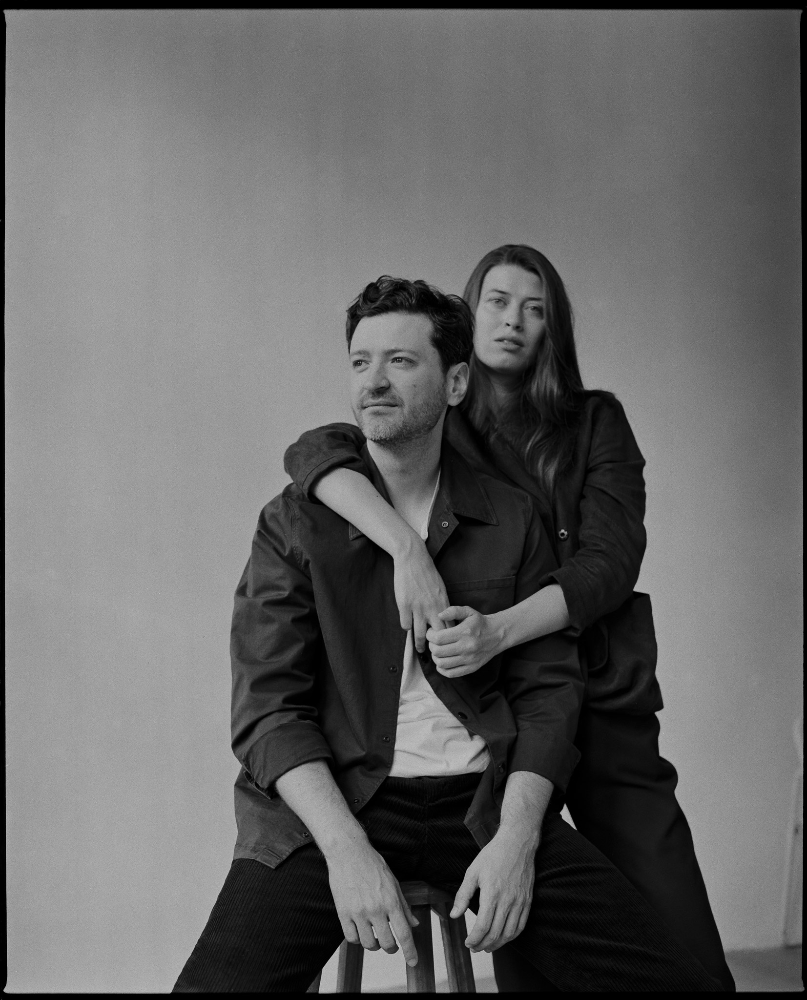

На самом деле, они очень веселые и улыбчивые, но сейчас мне хочется снимать именно так. Минималистично, можно даже сказать, немного монументально и обязательно в чб.

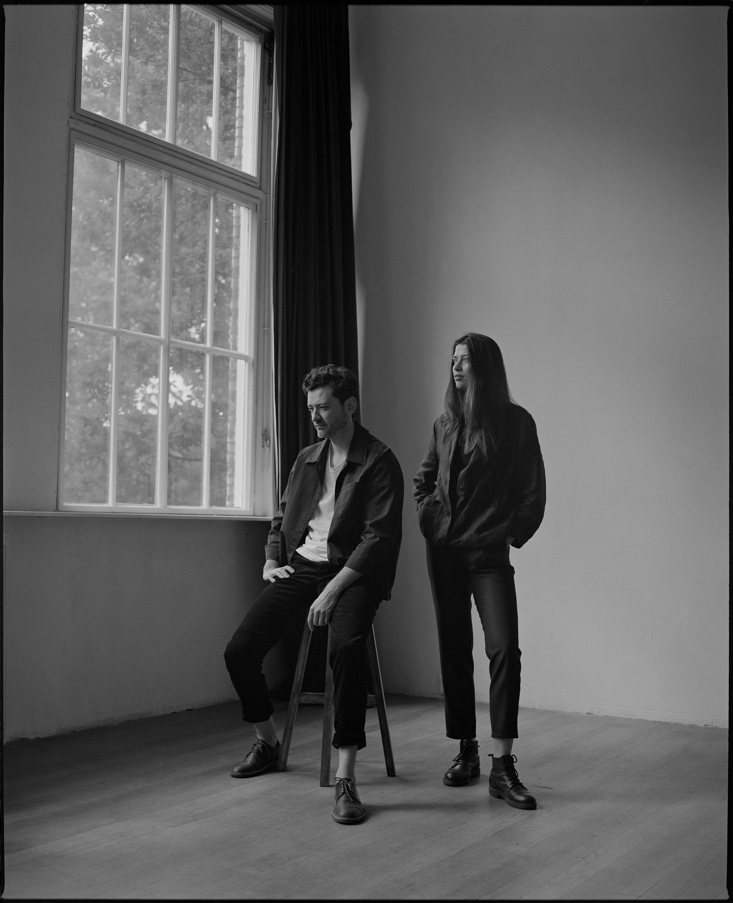

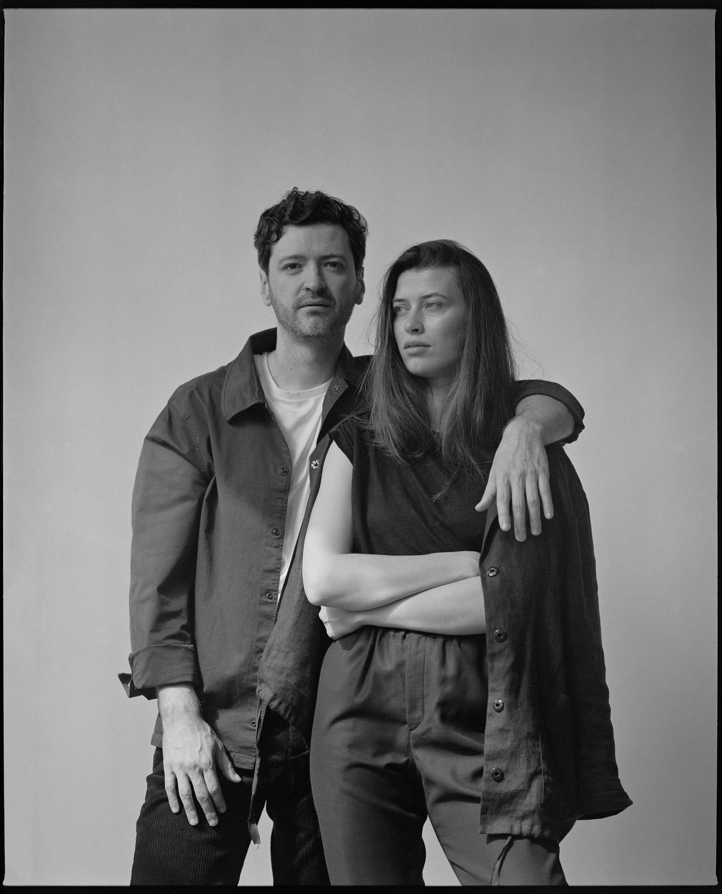

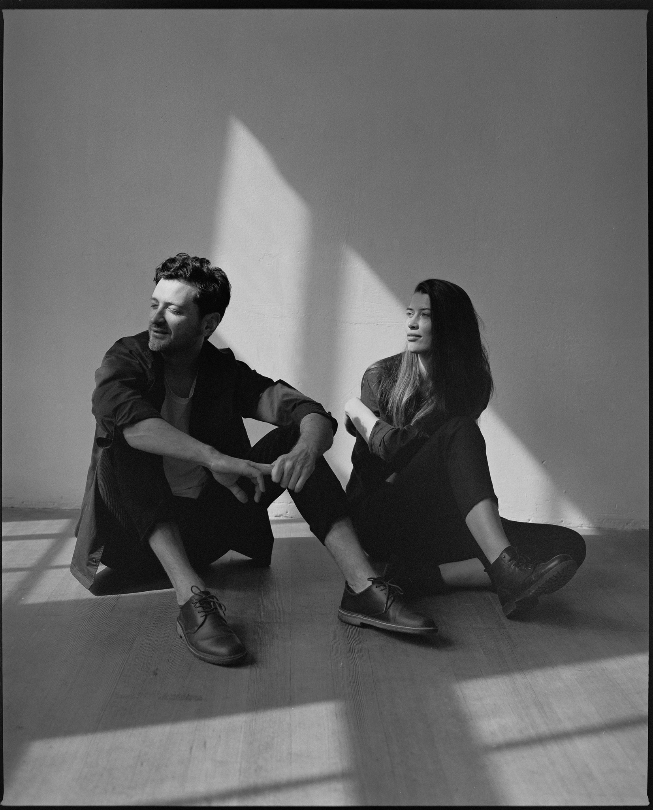

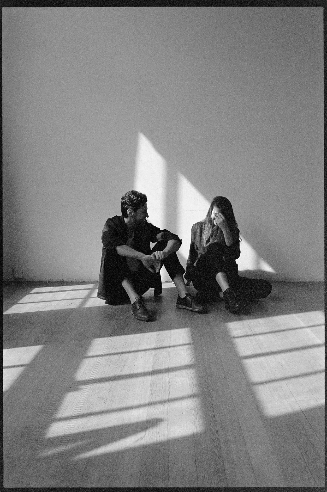

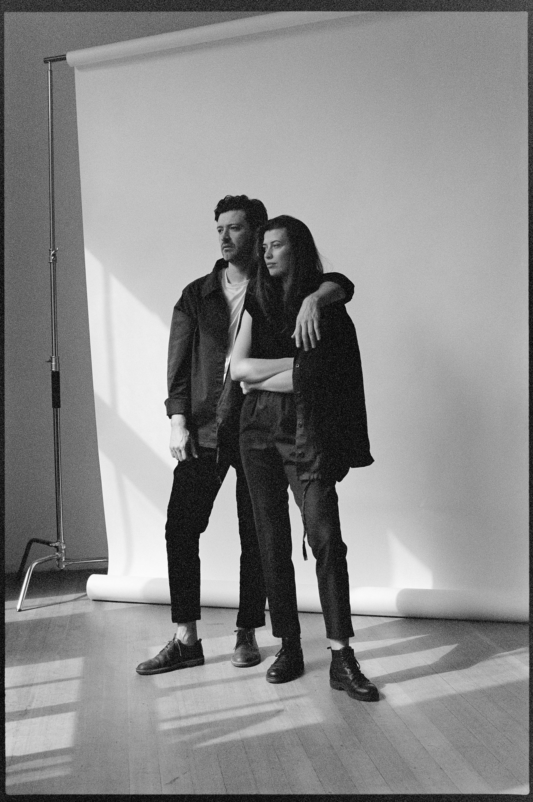

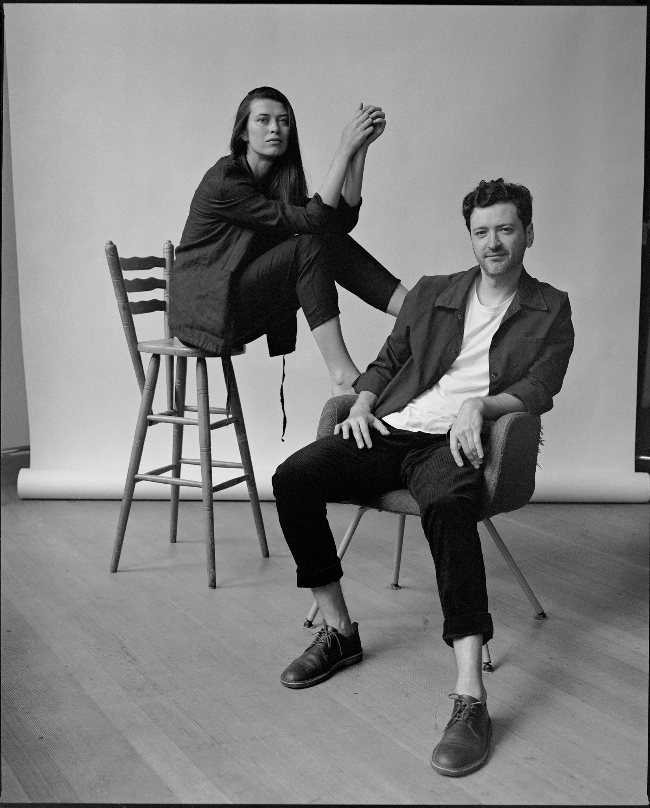

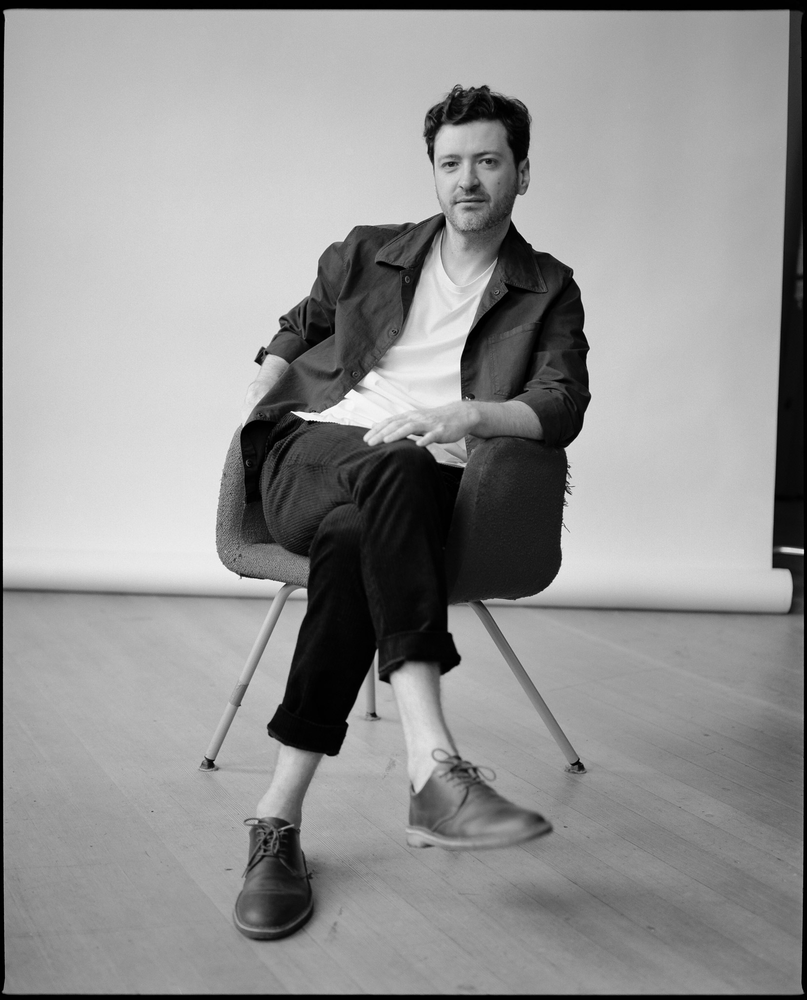

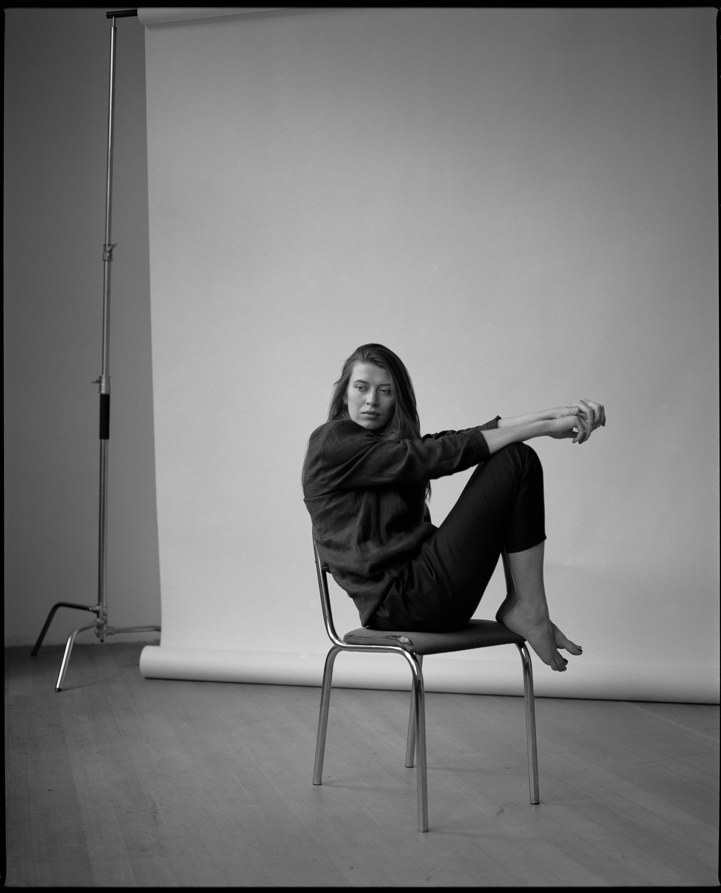

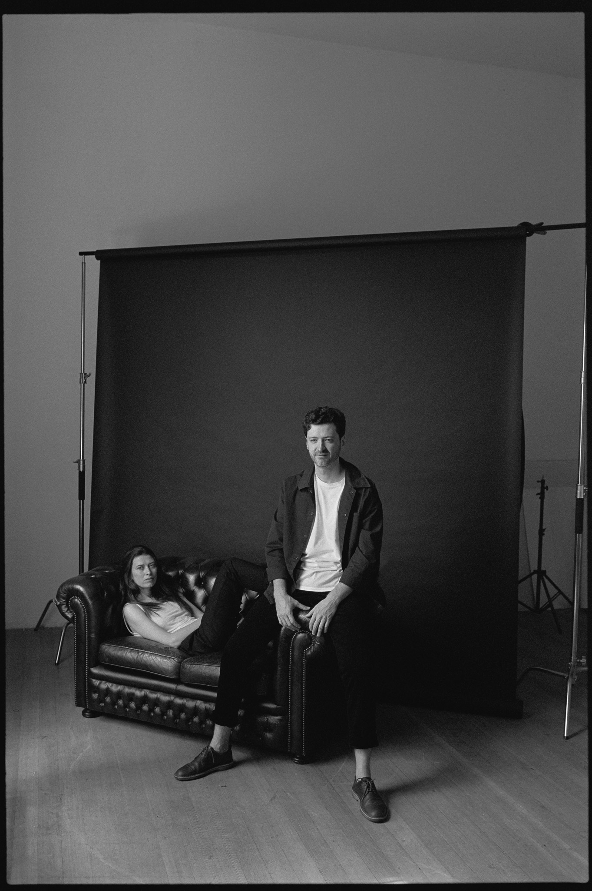

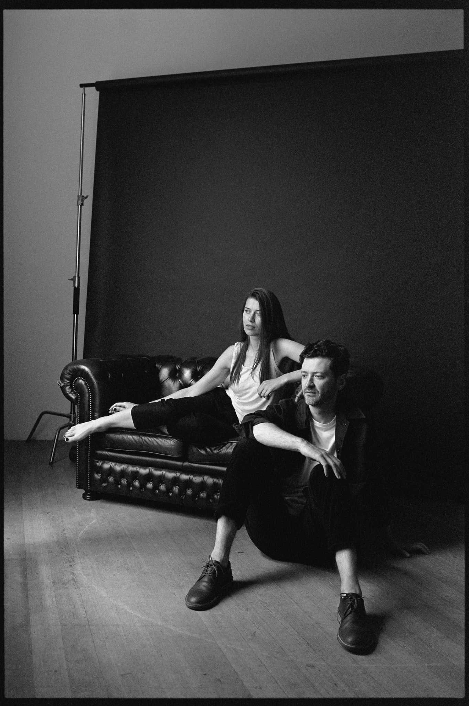

Возвращение ДЕДА!

## Видео на YouTube


🐍 